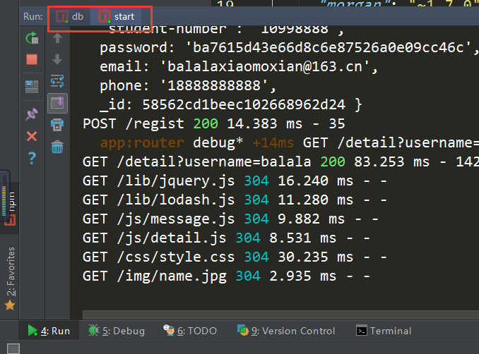
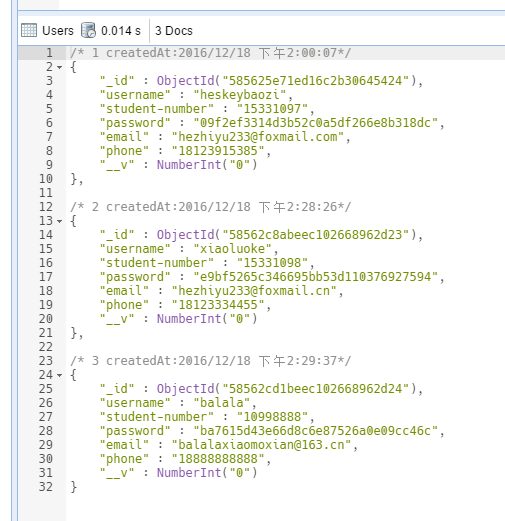

## 如何启动本项目？

打开终端，进入到本项目的根目录(`package.json`所在目录)。
先输入
```bash
npm run db
```
这个命令是在本项目下建立并打开`Mongodb`数据库.

然后输入
```bash
npm start
```
这样同时运行两个命令。如下图所示：



运行本项目，看到提示之后。用谷歌浏览器打开`http://localhost:8000`。即可启动项目。

# 特别注意
查看详情的页面是`/detail?username=MY_USER_NAME`，而不是`/?username=MY_USER_NAME`.
这样增强了详情页面的语义化，利于项目维护。

## 内置已经注册的项目有


用户名：`heskeybaozi`
密码：`hezhiyu`

## 会话
会话结束时刻是关闭浏览器的时刻。

## 关于加密
使用`node`原生模块 `crypto`进行加密。

## 其他
提示信息友好，在输入500毫秒之后进行输入检测并提示
